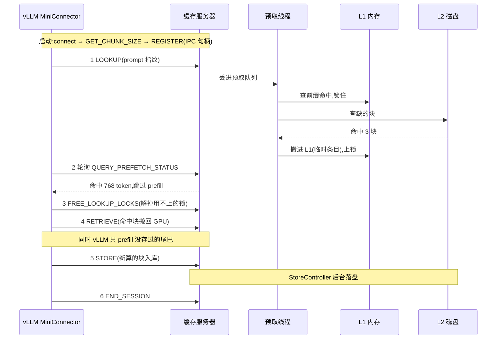

# mini-llmcache 执行流程拆解 — 一次请求的一生

> 从两个入口(`python -m lmcache_mini.server` 和 vLLM 的 `MiniConnector`)出发,
> 顺着一条请求走完全程。行号指向 `lmcache-mini/` 源码。

## 0. 两个入口,两条生命线

| 入口 | 位置 | 启动方式 |
|---|---|---|
| 缓存服务器 | `lmcache_mini/server.py:160` `main()` | `python -m lmcache_mini.server ...` |
| vLLM 挂载 | `lmcache_mini/integration/vllm_connector.py:49` `MiniConnector` | vLLM 按 `--kv-transfer-config` 反射加载 |

服务器是"仓库",vLLM 是"客户",两者之间只有两条通道:

- **ZMQ(电话线)**:传消息——查指纹、报进度、发指令
- **CUDA IPC 句柄(直通传送带)**:传 KV 数据本身,不经网络、不做拷贝

## 1. 第一幕:仓库开门(服务器启动)

`main()` 解析参数后调 `serve()`(`server.py:151`),组装出 `CacheServer`:

```
CacheServer
├── StorageManager(capacity, l2s)      ← 仓库本体
│   ├── L1Manager(PoolAllocator)       ← 桌面:一大块 pin 住的内存池
│   ├── PrefetchController             ← 找货员:后台线程,专管"找货"
│   ├── StoreController                ← 库管:后台线程,专管"落盘"
│   └── EvictionController(LRU)        ← 保洁:每秒巡查,满 80% 扔 20%
└── MQServer(bind_url)                 ← 电话总机:9 种消息各配一名接线员
```

最后 `threading.Event().wait()`(`server.py:157`)——服务器就此挂起,**一切由消息驱动**。

## 2. 第二幕:客户上门(vLLM 启动握手)

vLLM 实例化 `MiniConnector`(`vllm_connector.py:50`)后,立即完成三件事:

1. **拨号**:`MQClient` 用 ZMQ DEALER socket 连上仓库电话线
2. **问规则**:同步调用 `GET_CHUNK_SIZE`——"你家按多大一块切?"(默认 256 token)
3. **办会员卡**:vLLM 的 KV cache 张量经 `export_kv_caches` 变成 IPC 句柄,随 `REGISTER_KV_CACHE` 发往服务器

服务器收到注册(`server.py:51`):用句柄**重建出指向同一块显存的张量**,备好两条流水线(出库 d2h、入库 h2d),打印:

```
REGISTER Qwen/Qwen3-0.6B rank 0/1 (chunk=28 MiB, 1 engines)
```

从此仓库管理员能直接摸到客户家的显存——**这就是零拷贝的秘密**。

## 3. 第三幕:请求的一生



### ① LOOKUP —— "这个开头你存过吗?"

- 请求第一次进调度器,vLLM 调 `get_num_new_matched_tokens`(`vllm_connector.py:93`),把 prompt 截成整块,异步发出 `LOOKUP`
- 服务器(`server.py:77`)对 token 切块算指纹——指纹是**前缀链式 BLAKE3**(`hasher.py`):第 3 块的指纹里烙着前 2 块的信息,所以"前 300 个 token 存没存过"只需查一次表

### ② 预取流水线 —— "仓库里翻箱倒柜"

`LOOKUP` 只是张"开工单",真正的活丢给 `PrefetchController` 后台线程:

1. **查桌面**:`reserve_read_prefix` 按顺序数 L1 连续命中几块,命中的**先锁住**(读计数 +1,防止保洁误扔)
2. **查文件柜**:缺的块并行问所有 L2 adapter
3. **搬上桌**:L2 命中的块,申请内存、从磁盘读进 L1(临时条目)
4. **挂牌**:结果记入 `hits[request_id]`,所有命中块保持锁定,等客户来取

### ③ 轮询 + 跳过 —— "前面 768 个词不用读了"

- vLLM 一边 prefill,一边反复打 `QUERY_PREFETCH_STATUS` 问"查好了没?"
- 服务器答:`命中块数 / world_size × 块大小` = 可跳过的 token 数
- vLLM 把这部分标记为"外部已算好",**只 prefill 没存过的尾巴**
- 同时发 `FREE_LOOKUP_LOCKS`:vLLM 自己会算的部分,锁先解掉;要搬回来的部分,锁继续押着

### ④ RETRIEVE —— "把草稿搬回我的显存"

- vLLM 在开算之前(`start_load_kv`)就提交了 RETRIEVE——**搬数据和算尾巴并行**
- 服务器 `transfer.load`(`l0/transfer.py:107`)用双 CUDA stream 流水线:
  - copy 流:内存 → 中转区(3 个缓冲轮流用,一边装一边卸)
  - kernel 流:`index_copy_` 把中转区写回显存里对应的 block
- 干完记录一个 interprocess CUDA event,句柄发回 vLLM——凭它判断"GPU 数据就绪了"(`DeviceFuture.done`)

### ⑤ STORE —— "新算的草稿请入库"

- 算完尾巴,vLLM 在 `wait_for_save` 提交 STORE
- 服务器先 `reserve_write`:给没存过的块**分配内存 + 挂写锁**(写锁期间不可读)
- `transfer.store` 反向流水线:`index_select` 把各层 KV 块抽进中转区 → H2D 拷进 pinned 内存
- 摘掉写锁 → 广播"货上架了":
  - LRU 把它挪到"最近使用"队头
  - StoreController 收到通知,后台**异步落盘**(先写临时文件再 rename,防半截文件)

### ⑥ END_SESSION —— "结账走人"

请求结束,`request_finished` 清掉 tracker、发 `END_SESSION`;服务器释放该请求押着的所有锁,临时条目归还内存池。

## 4. 三个后台线程,仓库的隐形运转

| 线程 | 触发时机 | 干什么 |
|---|---|---|
| PrefetchController | 收到 LOOKUP | 查 L1 前缀 → 查 L2 → 搬进 L1 → 锁住等客户 |
| StoreController | L1 写完一块 | 把新块异步写进 L2,不挡客户 |
| EvictionController | 每秒 | 桌面超 80% 就按 LRU 扔 20%(只扔没人用的) |

## 5. 四个关键设计,一句话一个

1. **前缀链式哈希**:命中判断从"全文比对"变成"一次查表"
2. **引用计数锁**:写锁 / 读锁 / 临时条目三层,保证"正在用的绝不丢,用完即弃"
3. **CUDA IPC 零拷贝**:两个进程共享同一块显存,数据不落地
4. **双流三缓冲流水线**:拷贝与搬运重叠,才能跑出几十 GB/s

## 6. 速查表:六种消息去哪儿

| 消息 | 服务器找谁 | 效果 |
|---|---|---|
| LOOKUP | prefetch.start_session | 开工单 |
| QUERY_PREFETCH_STATUS | prefetch.query | 问结果 |
| FREE_LOOKUP_LOCKS | prefetch.release_first | 渐进解锁 |
| RETRIEVE | transfer.load + prefetch.release | 搬回 GPU |
| STORE | transfer.store + l1.finish_write | 入库 + 触发落盘 |
| END_SESSION | prefetch.end_session | 清场 |

---

一句话总结:**哈希定身份,IPC 免搬运,锁保平安,线程不挡路**——这就是 LMCache 的核心骨架。
