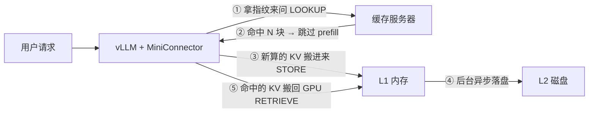

# mini-llmcache — 3 分钟看懂一个 KV Cache 共享系统

> 这是 [LMCache](https://github.com/LMCache/LMCache) 的迷你教学版(全部代码约 1200 行 Python,
> 位于 `lmcache-mini/`),完整复刻了它的核心思路:**把 LLM 算过的"草稿"存起来,下次遇到同样的开头直接抄**。

## 它解决什么问题?

每次问 LLM 问题,模型都要先把你的 prompt 从头到尾"读"一遍(prefill),生成一份叫 **KV cache** 的中间草稿,然后才开始逐字回答。

问题在于:

- 两个人引用同一本 500 页的书提问,模型要**各自**重读一遍,重复烧算力;
- 草稿用完就扔,下次同样的开头还得重算。

LMCache 的想法很简单:**草稿别扔,存起来共享**。谁的 prompt 开头跟存过的一样,就把现成的草稿直接搬回来,只算没存过的新部分。

## 它是怎么做到的?

1. **切块 + 指纹**:prompt 每 256 个 token 切一块,用 BLAKE3 给每块算指纹。指纹是"前缀链式"的——第 3 块的指纹里藏着前 2 块的信息,所以判断"前 300 个 token 存没存过"只需查一次。
2. **先问后算**:请求进来先拿指纹去缓存服务器问"命中多少块?",命中的部分直接跳过,只 prefill 没存过的尾巴。
3. **算完入库**:新算出的 KV cache 从 GPU 搬到内存(L1),再异步落盘(L2)。
4. **跨进程直传**:vLLM 和缓存服务器是两个进程,但靠 CUDA 的 IPC 句柄**直接共享显存**,中间没有一次数据拷贝——这是它能跑出几十 GB/s 吞吐的原因。

## 一张图看懂



用办公室打比方:

- **L1(内存)** = 桌上的文件,伸手就拿到,但地方小(默认 8~20 GB)
- **L2(磁盘)** = 文件柜,地方大但拿取慢;预取线程会提前把柜子里的文件搬到桌上
- **锁机制** = 正在被读写的文件不许扔;桌面太满时(80% 水位线)按 LRU 淘汰 20%

## 目录地图

| 目录 | 一句话职责 |
|---|---|
| `lmcache_mini/server.py` | 缓存服务器大脑:注册引擎、查指纹、调度搬运 |
| `lmcache_mini/hasher.py` | 给 prompt 切块算指纹(**核心**) |
| `lmcache_mini/mq.py` | 用 ZeroMQ 搭的简易 RPC 电话线 |
| `lmcache_mini/protocol.py` | 9 种消息类型 + 数据结构定义 |
| `lmcache_mini/l0/` | 显卡侧搬运工:双 CUDA stream 流水线 + 零拷贝 IPC |
| `lmcache_mini/l1/` | 桌上文件管理:内存池、读写锁、LRU、预取 |
| `lmcache_mini/l2/` | 文件柜:插拔式 adapter(自带文件系统版 + mock 版) |
| `lmcache_mini/integration/vllm_connector.py` | 打进 vLLM 的钩子,告诉它何时存、何时取、能跳多少 |

## 跑起来

```bash
# 1. 起缓存服务器(L1 8GB,L2 落盘到 /tmp/mini-l2)
python -m lmcache_mini.server --port 45881 --l1-size-gb 8 \
    --l2-adapter '{"type": "fs", "base_path": "/tmp/mini-l2"}'

# 2. 起 vLLM,挂上 MiniConnector
vllm serve Qwen/Qwen3-0.6B --enforce-eager \
    --max-model-len 4096 --no-enable-prefix-caching \
    --kv-transfer-config '{"kv_connector": "MiniConnector",
                           "kv_connector_module_path": "lmcache_mini.integration.vllm_connector",
                           "kv_role": "kv_both",
                           "kv_connector_extra_config": {"mini.port": 45881}}'

# 3. 发一个带超长重复前缀的请求
curl -s http://localhost:8000/v1/completions -H 'Content-Type: application/json' -d "{
    \"model\": \"Qwen/Qwen3-0.6B\", \"temperature\": 0, \"max_tokens\": 24,
    \"prompt\": \"$(python3 -c "print('A field guide to the birds of North America. ' * 80)")\"}"
```

服务器日志会告诉你一切:

```
STORE    rid=... tokens [0, 768) L0->L1 38.1 GB/s   ← 第一次:算完存起来
RETRIEVE rid=... tokens [0, 768) hit L1=3 L2=0      ← 第二次:直接搬回来,prefill 全跳过
```

> 小提示:首次 STORE 和 RETRIEVE 需要 warmup,会慢 30~40 倍,第二次起才是真实速度。

## 适合谁读

想搞清楚"KV cache 还能这么玩"的人。这里没有生产级系统的复杂工程,但哈希、分层缓存、锁协议、
零拷贝传输、异步预取这些核心机制一个不少——读完它,再去看真正的
[LMCache](https://github.com/LMCache/LMCache) 源码会轻松很多。

想看从入口代码开始的完整执行流程拆解(一次请求的一生),见 [FLOW.md](FLOW.md);
想深入 vLLM 侧副驾 MiniConnector 的逐行拆解,见 [CONNECTOR.md](CONNECTOR.md)。
