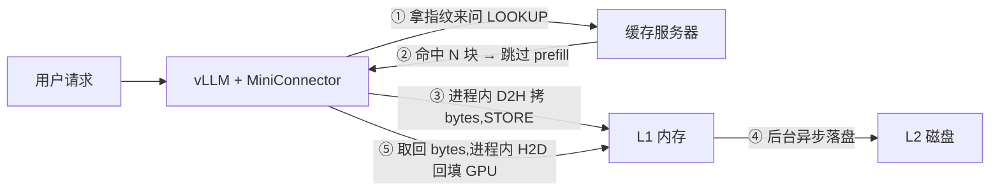
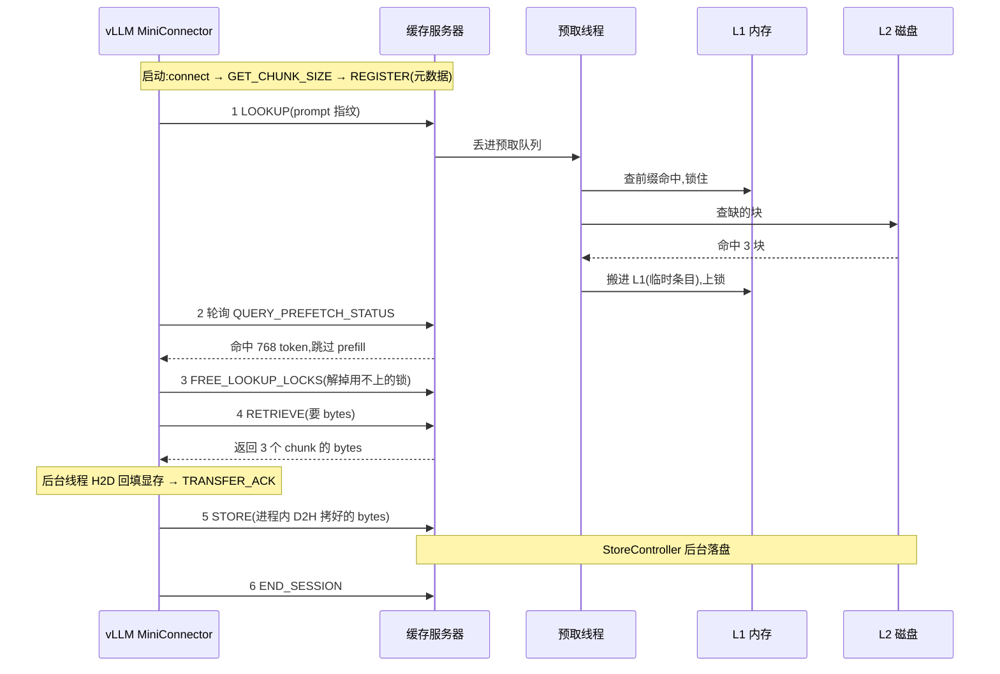

# mini-llmcache 完全拆解 — 从 3 分钟看懂到逐文件源码详解

> 这是 [LMCache](https://github.com/LMCache/LMCache) 的迷你教学版(全部代码约 870 行 Python),
> 完整复刻了它的核心思路:**把 LLM 算过的"草稿"存起来,下次遇到同样的开头直接抄**。
> 同时支持 NVIDIA GPU 与 Ascend NPU;NPU 适配见 [ascend_env.md](ascend_env.md)。

---

# Part 1 · 总览

## 它解决什么问题?

每次问 LLM 问题,模型都要先把你的 prompt 从头到尾"读"一遍(prefill),生成一份叫 **KV cache** 的中间草稿,然后才开始逐字回答。

问题在于:

- 两个人引用同一本 500 页的书提问,模型要**各自**重读一遍,重复烧算力;
- 草稿用完就扔,下次同样的开头还得重算。

LMCache 的想法很简单:**草稿别扔,存起来共享**。谁的 prompt 开头跟存过的一样,就把现成的草稿直接搬回来,只算没存过的新部分。

## 它是怎么做到的?

1. **切块 + 指纹**:prompt 每 256 个 token 切一块,用 BLAKE3 给每块算指纹。指纹是"前缀链式"的——第 3 块的指纹里藏着前 2 块的信息,所以判断"前 300 个 token 存没存过"只需查一次。
2. **先问后算**:请求进来先拿指纹去缓存服务器问"命中多少块?",命中的部分直接跳过,只 prefill 没存过的尾巴。
3. **算完入库**:新算出的 KV 从 GPU 拷成字节(L1),再异步落盘(L2)。
4. **进程内搬运**:GPU⇄CPU 的拷贝全部发生在 vLLM 进程内,跨进程只走 ZMQ 传字节——这是与官方 LMCache-Ascend 一致的架构(NPU 无法跨进程共享显存)。

## 一张图看懂



用办公室打比方:

- **L1(内存)** = 桌上的文件,伸手就拿到,但地方小(默认 8~20 GB)
- **L2(磁盘)** = 文件柜,地方大但拿取慢;预取线程会提前把柜子里的文件搬到桌上
- **锁机制** = 正在被读写的文件不许扔;桌面太满时(80% 水位线)按 LRU 淘汰 20%
- **搬运工** = vLLM 进程内的双流流水线:GPU 上货、卸货都在客户家里完成,快递只送纸箱(bytes)

---

# Part 2 · 执行流程拆解:一次请求的一生

> 从两个入口(`python -m mini_llmcache.server` 和 vLLM 的 `MiniConnector`)出发,
> 顺着一条请求走完全程。行号指向 `mini_llmcache/` 源码。

## 0. 两个入口,一条生命线

| 入口 | 位置 | 启动方式 |
|---|---|---|
| 缓存服务器 | `mini_llmcache/server.py:197` `main()` | `python -m mini_llmcache.server ...` |
| vLLM 挂载 | `mini_llmcache/integration/vllm_connector.py:66` `MiniConnector` | vLLM 按 `--kv-transfer-config` 反射加载 |

服务器是"仓库",vLLM 是"客户",两者之间只有**一条 ZMQ 电话线**,两种用途:

- **传指令**:查指纹、报进度、发消息
- **传数据**:KV 块序列化成 bytes 收发(GPU 搬运在 vLLM 进程内完成,仓库只碰 CPU 内存)

## 1. 第一幕:仓库开门(服务器启动)

`main()` 解析参数后调 `serve()`(`server.py:187`),组装出 `CacheServer`:

```
CacheServer
├── StorageManager(capacity, l2s)      ← 仓库本体
│   ├── L1Manager(PoolAllocator)       ← 桌面:一大块 pin 住的内存池
│   ├── PrefetchController             ← 找货员:后台线程,专管"找货"
│   ├── StoreController                ← 库管:后台线程,专管"落盘"
│   └── EvictionController(LRU)        ← 保洁:每秒巡查,满 80% 扔 20%
└── MQServer(bind_url)                 ← 电话总机:10 种消息各配一名接线员
```

最后 `threading.Event().wait()`——服务器就此挂起,**一切由消息驱动**。注意:服务器进程纯 CPU,连 `torch.npu` 都不需要。

## 2. 第二幕:客户上门(vLLM 启动握手)

vLLM 实例化 `MiniConnector`(`vllm_connector.py:66`)后,立即完成三件事:

1. **拨号**:`MQClient` 用 ZMQ DEALER socket 连上仓库电话线;`GET_CHUNK_SIZE` 带 30 秒超时,连不上就直接报错退出
2. **问规则**:"你家按多大一块切?"(默认 256 token)
3. **办会员卡**:vLLM 把 KV 张量**留在自己进程里**,建好本地搬运引擎(`KVTransfer`,双流三缓冲流水线),只把元数据(`chunk_nbytes` 等)随 `REGISTER_KV_CACHE` 发给仓库

服务器收到注册(`server.py:77`):记下这个引擎的 chunk 大小、block 大小,打印:

```
REGISTER Qwen/Qwen3-0.6B rank 0/1 (chunk=28 MiB, 1 engines)
```

从此仓库管仓库的货,客户管客户家的显存——**互不越界**。

## 3. 第三幕:请求的一生



### ① LOOKUP —— "这个开头你存过吗?"

- 请求第一次进调度器,vLLM 调 `get_num_new_matched_tokens`(`vllm_connector.py:126`),把 prompt 截成整块,异步发出 `LOOKUP`
- 服务器(`server.py:103`)对 token 切块算指纹——指纹是**前缀链式 BLAKE3**(`utils/hasher.py:26`):第 3 块的指纹里藏着前 2 块的信息,所以"前 300 个 token 存没存过"只需查一次表

### ② 预取流水线 —— "仓库里翻箱倒柜"

`LOOKUP` 只是张"开工单",真正的活丢给 `PrefetchController` 后台线程:

1. **查桌面**:`reserve_read_prefix` 按顺序数 L1 连续命中几块,命中的**先锁住**(读计数 +1,防止保洁误扔)
2. **查文件柜**:缺的块并行问所有 L2 adapter
3. **搬上桌**:L2 命中的块,申请内存、从磁盘读进 L1(临时条目)
4. **挂牌**:结果记入 `hits[request_id]`,所有命中块保持锁定,等客户来取

### ③ 轮询 + 跳过 —— "前面 768 个词不用读了"

- vLLM 一边 prefill,一边反复打 `QUERY_PREFETCH_STATUS` 问"查好了没?"
- 服务器答:`命中块数 / world_size × 块大小` = 可跳过的 token 数
- vLLM 把这部分标记为"外部已算好",**只 prefill 没存过的尾巴**
- 同时发 `FREE_LOOKUP_LOCKS`:vLLM 自己会算的部分,锁先解掉;要搬回来的部分,锁继续押着

### ④ RETRIEVE —— "把草稿搬回我的显存"

- vLLM 在开算之前(`start_load_kv`,`vllm_connector.py:304`)就提交了 RETRIEVE——**取货和算尾巴并行**
- 服务器(`server.py:148`)把命中的 L1 对象序列化成 bytes 返回,并释放这批预取锁
- vLLM 侧后台线程 `_finish_load`(`vllm_connector.py:285`)收到 bytes 后,用**进程内** H2D 流水线(`transfer.py:128` `from_host`)回填显存:
  - copy 流:bytes → pinned 内存 → 中转区(3 个缓冲轮流用,一边装一边卸)
  - kernel 流:`index_copy_` 把中转区写回显存里对应的 block
- 回填完成 → 发 `TRANSFER_ACK` → `done.set()` → vLLM 凭 `DeviceFuture.done()` 知道可以读这些 block

### ⑤ STORE —— "新算的草稿请入库"

- 算完尾巴,vLLM 在 `wait_for_save`(`vllm_connector.py:308`)提交 STORE
- 先**进程内** D2H:`transfer.to_host`(`transfer.py:92`)用反向流水线(`index_select` 抽块 → 拷进 pinned 内存)把 KV 块变成 bytes
- 服务器(`server.py:127`)先 `reserve_write`:给没存过的块**分配内存 + 挂写锁**(写锁期间不可读),把 bytes 写入 L1
- 摘掉写锁 → 广播"货上架了":
  - LRU 把它挪到"最近使用"队头
  - StoreController 收到通知,后台**异步落盘**(先写临时文件再 rename,防半截文件)

### ⑥ END_SESSION —— "结账走人"

请求结束,`request_finished` 清掉 tracker、发 `END_SESSION`;服务器释放该请求押着的所有锁,临时条目归还内存池。

## 4. 三个后台线程,仓库的隐形运转

| 线程 | 触发时机 | 干什么 |
|---|---|---|
| PrefetchController | 收到 LOOKUP | 查 L1 前缀 → 查 L2 → 搬进 L1 → 锁住等客户 |
| StoreController | L1 写完一块 | 把新块异步写进 L2,不挡客户 |
| EvictionController | 每秒 | 桌面超 80% 就按 LRU 扔 20%(只扔没人用的) |

## 5. 四个关键设计,一句话一个

1. **前缀链式哈希**:命中判断从"全文比对"变成"一次查表"
2. **引用计数锁**:写锁 / 读锁 / 临时条目三层,保证"正在用的绝不丢,用完即弃"
3. **进程内搬运**:GPU⇄CPU 拷贝全部在 vLLM 进程内,跨进程只传字节——CUDA/NPU 通吃
4. **双流三缓冲流水线**:拷贝与搬运重叠,实测 4~10 GB/s

一句话总结:**哈希定身份,进程内搬运,锁保平安,线程不挡路**——这就是 LMCache 的核心骨架。

---

# Part 3 · 副驾拆解:vllm_connector.py

> 目标文件:`mini_llmcache/integration/vllm_connector.py`(347 行)
> 它没有 main、从不单独运行——vLLM 启动时按 `--kv-transfer-config` 反射加载它,
> 然后在自己调度循环的固定位置,一遍遍调用它的"钩子"。全局流程见本文 Part 2。

## 1. 它在整个系统里的位置

缓存服务器(仓库)只会被动响应;谁来决定"何时存、何时取、能跳多少"?就是这个文件。
它像给 vLLM 装的**副驾**:vLLM 专心开车(调度、计算),副驾负责跟仓库联络,还兼任搬运工
(GPU⇄CPU 拷贝都在副驾手里,仓库只收字节)。

vLLM 提供的接口叫 `KVConnectorBase_V1`——本质是一张钩子清单,`MiniConnector` 把每个钩子填上自己的逻辑:

| vLLM 钩子 | vLLM 什么时候叫 | 副驾干什么 |
|---|---|---|
| `register_kv_caches` | 启动时 | 把 KV 张量留在本地,建好搬运引擎,只发元数据注册 |
| `get_num_new_matched_tokens` | 每个调度步,反复问 | 首次发 LOOKUP;之后轮询预取结果,报告"可跳过几个 token" |
| `update_state_after_alloc` | 给请求分好 block 后 | 记下 block 编号;标记"要搬货";发 FREE_LOOKUP_LOCKS |
| `build_connector_meta` | 每个调度步 | 读调度结果更新账本,开出 RETRIEVE / STORE 搬运单 |
| `start_load_kv` | 开始本轮计算**前** | 提交 RETRIEVE 单(取货与计算并行) |
| `wait_for_save` | 本轮计算**后** | 进程内 D2H 拷 bytes,提交 STORE 单 |
| `get_finished` | 调度循环查询 | 报告哪些请求搬完 / 存完了 |
| `request_finished` | 请求结束时 | 撕账本,发 END_SESSION |
| `shutdown` | 引擎关闭 | 注销会员卡,挂断电话 |

## 2. RequestTracker — 每个请求一本流水账

钩子会被 vLLM 反复调用,connector 自己没机会"记住"请求状态,于是给每个请求建一个账本(`vllm_connector.py:41`):

```
token 坐标轴: 0 ───────── vllm_hits ───────── lmcache_hits ─────────── 结尾
               │ vLLM 已算 │ 仓库有,要搬回来  │ 两边都没有,算完再存 │
               │           │   (RETRIEVE)     │      (STORE)        │
               └─ 首块重叠处用 skip_first_n_tokens 跳过,防止覆盖 ─────┘
```

关键字段:

- `lmcache_hits` 仓库说命中多少 token;`vllm_hits` vLLM 自己已算到哪——**两数之差就是要搬回来的部分**
- `num_stored_tokens` 已存进仓库多少——**存过的绝不再存**
- `block_ids` 请求占用的 GPU block 编号表,搬运单全靠它
- `lookup_resolved` / `load_pending` / `alloc_seen` 三个状态位,防止重复干活

## 3. 核心钩子的工作方式

### get_num_new_matched_tokens — "帮我算好了吗?"(line 126)

vLLM 每步都来问一次,回答分三种:

| 返回值 | 意思 |
|---|---|
| `(None, True)` | 仓库还没查完,下一步再来问 |
| `(n, True)` | 前 n 个 token 外部已算好,跳过! |
| `(0, False)` | 查完了,没有便宜可占,自己全算 |

第一次被问:发 **LOOKUP**(异步,发完就走),然后照常轮询;之后每次:打 `QUERY_PREFETCH_STATUS` 问预取线程查好没。注意是**轮询**而非阻塞等待——vLLM 一边 prefill 一边问,查到为止。服务器异常时 fail-open(返回"没有命中",让 vLLM 自己全算),不会拖垮引擎。

### update_state_after_alloc — "block 分好了"(line 162)

vLLM 分完 block 后调它,副驾做三件事:

1. 把新分配的 block 编号追加进账本
2. 有外部 token(`num_external_tokens > 0`)?→ 标记 `load_pending`,该搬货了
3. 首次分配时算好"哪些预取锁可以解":vLLM 自己会算的部分锁先放掉,要搬回来的部分**继续押着**——`FREE_LOOKUP_LOCKS`

### build_connector_meta — "开搬运单"(line 181)

每步调度结束,副驾读 `scheduler_output`(谁新来了、谁续算、谁这轮算了多少 token),更新账本,开出两张单:

- **RETRIEVE 单**(`generate_retrieve_op`,line 96):只开给 `load_pending` 的请求,范围 = [vllm_hits 向下取整到块边界, lmcache_hits);首块中 vLLM 已算的部分用 `skip_first_n_tokens` 标出,避免覆盖
- **STORE 单**(`generate_store_op`,line 108):三个上限取最小——① 请求总 token 数 ② block 装得下的 ③ vLLM 实际算完的;只存整块,存过的不再存

单子打包成 `MiniConnectorMetadata`(requests 列表)交给 vLLM。

### 两张单如何执行?(line 252 `submit_transfers`)

- **STORE 单**:在 `wait_for_save` 里执行——副驾**先在本进程** `to_host()` 把 KV 块拷成 bytes(同步),再随 `TransferPayload` 发给仓库
- **RETRIEVE 单**:在 `start_load_kv` 里提交——先异步问仓库要 bytes,同时起一个后台线程 `_finish_load`(line 285):拿到 bytes 后**在本进程** `from_host()` 回填显存,再发 `TRANSFER_ACK`、`done.set()`

这样 vLLM 的 forward 不被搬运阻塞,取货与计算并行。

## 4. 三个巧妙的设计

### ① DeviceFuture 双条件(`l0/transfer.py:19`)

仓库回消息("bytes 在这")≠ 显存里数据就绪。`DeviceFuture.done()` 要看**两个条件**:消息 future 完成,且后台线程 H2D 回填完成后 `done.set()`——两步都过,vLLM 才能读这些 block。

### ② 搬运全程在进程内(line 252 / 285)

GPU⇄CPU 的拷贝从来不交给仓库做:STORE 是"先拷后送",RETRIEVE 是"先取后填"。仓库只管理 CPU 内存,双方各管各的显存——这正是 Ascend NPU 能跑通的唯一姿势(跨进程共享显存被驱动禁止),也与官方 LMCache-Ascend 一致。

### ③ 两个空钩子,一条路线选择(line 332 / 337)

`wait_for_layer_load` / `save_kv_layer` 竟然是 `pass`!这不是偷懒:vLLM 给了两条路——"逐层加载 / 逐层保存"(这两个钩子),或"整块搬运"(metadata + submit_transfers)。本实现选了后者:所有搬运信息在 `build_connector_meta` 里打包、一次提交,配合双流流水线整块处理——LMCache 官方实现同样是整块路线。

## 5. 消息全景表:谁发、去哪、干什么

| 消息 | 从哪个钩子发出 | 服务器找谁 | 效果 | 同步 or 异步 |
|---|---|---|---|---|
| LOOKUP | get_num_new_matched_tokens(首次) | prefetch.start_session | 开工单 | 异步,发完就走 |
| QUERY_PREFETCH_STATUS | get_num_new_matched_tokens(轮询) | prefetch.query | 问结果 | 同步,快问快答 |
| FREE_LOOKUP_LOCKS | update_state_after_alloc | prefetch.release_first | 渐进解锁 | 异步 |
| RETRIEVE | start_load_kv | l1.read + prefetch.release | 返回 chunk bytes | 异步,后台线程回填 |
| STORE | wait_for_save | l1.reserve_write + finish_write | bytes 入库 + 触发落盘 | 异步,DeviceFuture 跟踪 |
| TRANSFER_ACK | _finish_load(回填完成后) | ack 处理器 | 打印 L1→L0 吞吐 | 异步 |
| END_SESSION | request_finished | prefetch.end_session | 清场 | 异步 |
| REGISTER / UNREGISTER | register_kv_caches / shutdown | 实例表增删 | 办/销会员卡 | 同步,要确认结果 |

---

# Part 4 · 源码详解:逐文件走读

> 把 `mini_llmcache/` 的每个文件拆开讲:它管什么、有哪些关键符号、设计上有什么讲究。
> 行号以当前代码为准。

## 4.1 全景:模块依赖关系

```
vLLM 进程                                cache server 进程
┌──────────────────────────────┐        ┌──────────────────────────────────┐
│ integration/vllm_connector.py│        │ server.py                        │
│   ├─ l0/transfer.py (搬运)   │        │   ├─ utils/hasher.py (指纹)      │
│   ├─ utils/device.py (设备)  │        │   ├─ mq.py (电话线)              │
│   ├─ l0/kv_format.py (布局)  │        │   └─ storage_manager.py          │
│   └─ mq.py (客户端)          │◄─ZMQ──►│        ├─ l1/memory.py   内存池  │
└───────────┬──────────────────┘        │        ├─ l1/manager.py  锁管理  │
            └──── protocol.py ─────────►│        │   ├─ l1/eviction.py LRU │
              (两端共享的数据结构)        │        │   ├─ l1/prefetch_...    │
                                        │        │   └─ l1/store_...       │
                                        │        └─ l2/base|fs|mock.py     │
                                        └──────────────────────────────────┘
```

只有 `protocol.py` 和 `mq.py` 被两个进程同时使用;其余模块各归一方。

## 4.2 protocol.py — 通信语言(全文件)

两个进程之间的所有对话,先在这里定义好"词表"。

| 符号 | 行号 | 职责 |
|---|---|---|
| `Req` | 9 | 10 种消息类型:注册/注销、LOOKUP/QUERY、STORE/RETRIEVE、FREE_LOOKUP_LOCKS、END_SESSION、TRANSFER_ACK |
| `ChunkKey` | 25 | **缓存条目的身份证**:`(chunk_hash, model, rank)` 三元组,冻结(frozen)可作 dict key |
| `LoadStoreOp` | 34 | 一张搬运单:token 范围 + block 编号 + 首块跳过数 |
| `ReqMeta` | 51 | 搬运单 + 消息类型 + 请求 id,connector metadata 的载体 |
| `TransferPayload` | 82 | STORE 时携带 bytes 与耗时;RETRIEVE 时空发、服务器回填 bytes |
| 其余 Payload | 60-117 | 每种消息的参数包,全部是普通 dataclass(可 pickle) |

设计要点:**全 dataclass + 无外部依赖**——保证 pickle 跨进程序列化的可靠性;`ChunkKey` 用 `frozen=True` 防止被误改。

## 4.3 utils/hasher.py — 给 prompt 按指纹(全文件)

```python
hash[i] = BLAKE3(hash[i-1] + tokens_of_chunk_i)   # hash[0] 从 NONE_HASH 起步
```

- `hash_one`(15 行):对一块 token 算哈希,**把前一块的哈希作为前缀喂进去**
- `NONE_HASH`(21 行):空前缀的哈希,链条的起点
- `chunk_hashes`(26 行):整条 prompt 的所有整块哈希;不足一块的尾巴直接忽略(不缓存半块)

为什么"前缀链式"是核心设计:因为 hash[i] 蕴含了 [0, i] 全部 token 的信息,**判断"前 300 个 token 存没存过"只需要查 hash[2] 这一个 key**,不用从 hash[0] 一路比过去——命中判定从 O(n) 变 O(1)。

## 4.4 mq.py — ZMQ 电话线(全文件)

| 符号 | 行号 | 职责 |
|---|---|---|
| `SocketLoop` | 22 | 单线程事件循环:一个 ZMQ socket + 一根自唤醒管道(pipe),用 `Poller` 同时监听两者;发消息先进队列再通过 pipe 唤醒发送 |
| `MQClient` | 65 | DEALER 端:`submit`(76)发请求拿 Future,`call`(83)阻塞等结果,支持超时 |
| `MQServer` | 103 | ROUTER 端:每个请求**起一个独立线程**处理(120 行 `handle`),handler 再慢也不挡别的请求 |

两个值得注意的健壮性设计:

1. **异常回传**(120 行):handler 抛异常 → 服务器把异常 pickle 回去 → 客户端 `future.set_exception` 原样抛出。没有这一步,服务器端一报错,客户端 future 就永远挂起。
2. **超时**:`call(timeout=...)`——connector 启动握手用它防"服务器没起、vLLM 干等"。

## 4.5 server.py — 仓库前台(197 行)

`CacheServer.__init__`(46)只做两件事:装配 `StorageManager`,给 10 种消息各配一名接线员(`self.mq.register`)。之后每个 handler 都是一小段直白的逻辑:

| handler | 行号 | 一句话 |
|---|---|---|
| `register` | 77 | 记下引擎的 `chunk_nbytes`,同时更新 `deployments[(model, world_size)]` 供 LOOKUP 查询 |
| `lookup` | 103 | 给 prompt 算指纹(跨所有 TP rank 各一份),丢给预取线程开工单 |
| `query` | 111 | 查预取结果,换算成"可跳过 token 数" |
| `store` | 127 | 把收到的 bytes 写进 L1(先 reserve_write 挂写锁,写完 finish_write) |
| `retrieve` | 148 | 把 L1 里的 bytes 读出来发回,同时释放预取锁 |
| `ack` | 168 | 收 connector 的搬运完成汇报,打印 L1→L0 吞吐 |

`op_keys`(97)是所有搬运类 handler 的公共底座:token 范围 → 指纹 → `ChunkKey` 列表。

## 4.6 l0/ 与 utils/ — 设备抽象 + 布局识别 + 搬运引擎

**`utils/device.py`(68 行)** — 多加速器设备选择,三个函数搞定:

| 函数 | 行号 | 职责 |
|---|---|---|
| `get_device_type` | 19 | 借助 `transformers.utils` 的可用性检查,按优先级探测 NPU/CUDA/XPU/MLU/MUSA/MPS,全都没有返回 `"cpu"` |
| `set_device` | 43 | 按 `device.type` 分发到对应加速器的 `set_device` |
| `get_device_module` | 58 | 返回活动加速器的 torch 命名空间(`torch.npu` / `torch.cuda` / ...);无加速器时抛出清晰的 `RuntimeError` |

消费者(transfer、connector)在模块顶层执行 `device_module = get_device_module()`(结果已 `lru_cache` 缓存,探测只做一次)——所有设备相关代码(stream/event/同步)都通过这个命名空间,上层一行都不用改,换加速器也一行都不用动。

**`l0/kv_format.py`(48 行)** — 不同 vLLM 版本的 KV 张量形状不同,`detect`(23)按形状识别四种布局:

| 布局 | 形状 | 出处 |
|---|---|---|
| FA_BLOCK_FIRST | (blocks, 2, bs, heads, hs) | CUDA vLLM 默认 |
| FA_KV_FIRST | (2, blocks, bs, heads, hs) | 部分 CUDA 配置 |
| FA_SPLIT | (blocks, bs, heads, hs) | **vllm-ascend:K/V 各自独立** |
| MLA | (blocks, bs, hs) | MLA 架构 |

`normalize`(40)把它们统一成"dim 0 = block 编号"的标准姿势,搬运引擎就能一视同仁。注意 FA_KV_FIRST 的判定只看 `shape[0] == 2`——ascend 会 padding block 数,不能拿它跟 `num_blocks` 比相等。

**`transfer.py`(171 行)** — 搬运引擎本体(运行在 vLLM 进程内):

| 符号 | 行号 | 职责 |
|---|---|---|
| `DeviceFuture` | 19 | 双条件完成判定:消息回执 + GPU 回填线程的 done 事件 |
| `Pipeline` | 42 | 双流三缓冲:kernel 流负责抽块/填块,`copy` 流负责 DMA;`ready`/`free` 事件把三个缓冲槽串成流水线 |
| `KVTransfer` | 76 | 按注册时的 KV 张量构造 d2h/h2d 两条流水线 |
| `to_host` | 92 | D2H:`index_select` 抽块 → 拷进 pinned 内存 → 返回 bytes 列表 |
| `from_host` | 128 | H2D:bytes → pinned 内存 → `index_copy_` 填回显存,支持首块 `skip_blocks` |

两个跨平台正确性决策(都是 Ascend 逼出来的):

- 出入口用**设备级 `synchronize()`** 代替 CUDA 的 interprocess event(NPU 驱动不支持后者);
- bytes 进 pinned 内存用 **numpy 直接拷贝**(`cpu_bufs[buf].numpy()[:] = ...`),避免 `torch.frombuffer` 对只读 buffer 的告警。

## 4.7 l1/memory.py — 桌面内存池(全文件)

- `MemoryObj`(15):一个已分配切片的句柄;`byte_array` property(22)给出可读写的字节视图,`nbytes`(27)给出大小
- `PoolAllocator`(31):**一整块 pinned 内存** + 一个游标 `brk` + 按大小分类的空闲表 `free_segments`

```python
allocate(count, nbytes):  先翻空闲表(后进先出),不够再推进游标;还不够 → 返回 None(整体失败,已拿的退回去)
free(objs):               偏移量记回对应大小的空闲表
```

要点:pinned(page-locked)内存让 vLLM 进程的 DMA 可以直接读写这些缓冲区;`allocate` 的"要么全给要么全不给"语义让上层(reserve_write)可以干净地失败。

## 4.8 l1/manager.py — 锁协议的心脏(全文件)

`L1Manager`(52)管三样东西:条目表 `entries`、一把大锁、一组监听者(listeners)。**锁协议**是本文件(乃至整个项目)最值得读懂的部分:

| 状态 | 含义 | 谁设置 | 谁清除 |
|---|---|---|---|
| `write_locked` | 正在写入,不可读 | `reserve_write`(66) | `finish_write`(86) |
| `read_count > 0` | 正被读/被预取押着,不可淘汰 | `reserve_read`(103)/`reserve_read_prefix`(116) | `finish_read`(139) |
| `is_temporary` | 从 L2 预取来的"一次性"条目 | `reserve_write(is_temporary=True)` | read_count 归零即**直接释放**(139 行),不留在缓存里 |

关键方法一览:

- `reserve_write`(66):只给**缺失**的 key 分配内存并挂写锁,已存在的 key 返回 None——重复 STORE 自动跳过
- `reserve_read_prefix`(116):按顺序数连续可读前缀并全部加读计数——L1 命中检测 + 锁定一步完成
- `finish_read`(139):读计数归零;临时条目当场归还内存池,常驻条目通知 LRU"被碰过了"
- `delete`(150):只删"没人用"的条目(`force=True` 例外,预取失败清理用)
- 事件通知(`notify`,62):所有状态变化广播给监听者(空列表不广播),LRU 和 StoreController 都靠它驱动

## 4.9 l1/ 的三个后台线程

| 文件 | 类 | 触发 | 逻辑 |
|---|---|---|---|
| `eviction.py` | `LRUPolicy`(15) | 监听 created/touched/removed | `OrderedDict` 维护新旧顺序;`get_victims`(35)从队头(最旧)取 |
| `eviction.py` | `EvictionController`(49) | 每秒醒来 | 占用超过 80% 水位线,按 LRU 淘汰 20%(只挑 unlocked) |
| `prefetch_controller.py` | `PrefetchController`(20) | 收到 LOOKUP 开工单 | 见下 |
| `store_controller.py` | `StoreController`(11) | 监听 write_finished | 拿到新写块的读锁 → 逐个 L2 落盘 → 释放读锁 |

`PrefetchController` 的 `prefetch`(36)是一条清晰的分段流水:

```
reserve_read_prefix(L1 前缀命中) → lookup_l2s(各 L2 并行问) → reserve_load(临时条目占位)
→ load_from_l2s(命中多的 adapter 优先读) → resolve(记结果 + 押住所有命中块的读锁)
```

两个细节值得品味:

- `resolve`(91)里有个**竞态防御**:如果 connector 已经 `end_session` 抢先一步,这里就把读锁全放了(94 行的 `request_id in self.hits` 判断);
- `held` 字典(押住的锁)由 connector 分三波渐进释放:`FREE_LOOKUP_LOCKS`(自己会算的部分)→ RETRIEVE(搬走的块)→ END_SESSION(兜底)。

## 4.10 l2/ — 文件柜:可插拔的三层

| 文件 | 内容 |
|---|---|
| `base.py` | `L2Adapter` **ABC**(19):自带一个工作线程串行执行 store/lookup/load;异常经 `future.set_exception` 回传,线程不死 |
| `fs.py` | 文件系统实现:每块一个文件 `model@rank@hash.data`;写入走 tmp + `os.replace` 原子改名(26),断电也不会留半截文件 |
| `mock.py` | 内存字典实现,测试专用 |

接口契约只有三条(见 base 的抽象方法):`store(keys, objs)` 落盘;`lookup(keys) -> 前缀命中数`;`load(keys, objs) -> 实际读取数`。想接 Redis/Mooncake,写一个 ~20 行的子类即可。

## 4.11 storage_manager.py — 装配图(16 行)

整个仓库的"总装线"——六行代码把四个部件拧在一起:

```python
self.l1        = L1Manager(PoolAllocator(capacity_bytes))   # 桌面
self.store     = StoreController(self.l1, l2s) if l2s       # 库管(有 L2 才存在)
self.prefetch  = PrefetchController(self.l1, l2s)           # 找货员
self.eviction  = EvictionController(self.l1, LRUPolicy())   # 保洁
```

构造完成即启动三个守护线程,仓库开张。注意 `self.store` 在无 L2 时为 None——服务器可以只跑 L1。

---

# Part 5 · 上手与地图

## 目录地图

| 目录 | 一句话职责 |
|---|---|
| `mini_llmcache/server.py` | 缓存服务器:注册引擎、查指纹、管理 L1/L2(纯 CPU,不碰 GPU) |
| `mini_llmcache/utils/` | 公共工具:切块算指纹(`hasher.py`)+ 多加速器设备选择(`device.py`,支持 NPU/CUDA/XPU/MLU/MUSA/MPS) |
| `mini_llmcache/mq.py` | 用 ZeroMQ 搭的简易 RPC 电话线 |
| `mini_llmcache/protocol.py` | 10 种消息类型 + 数据结构定义 |
| `mini_llmcache/l0/` | 搬运工:跑在 vLLM 进程里的双流流水线(`transfer.py`)+ KV 布局识别(`kv_format.py`) |
| `mini_llmcache/l1/` | 桌上文件管理:内存池、读写锁、LRU、预取 |
| `mini_llmcache/l2/` | 文件柜:插拔式 adapter(自带文件系统版 + mock 版) |
| `mini_llmcache/integration/vllm_connector.py` | 打进 vLLM 的钩子,告诉它何时存、何时取、能跳多少 |
| `tests/` | 49 个 pytest 用例:单元 + 集成 + 设备门控的搬运往返 |

## 跑起来

```bash
# 1. 起缓存服务器(L1 8GB,L2 落盘到 /tmp/mini-l2)
python -m mini_llmcache.server --port 45881 --l1-size-gb 8 \
    --l2-adapter '{"type": "fs", "base_path": "/tmp/mini-l2"}'

# 2. 起 vLLM,挂上 MiniConnector
vllm serve Qwen/Qwen3-0.6B --enforce-eager \
    --max-model-len 4096 --no-enable-prefix-caching \
    --kv-transfer-config '{"kv_connector": "MiniConnector",
                           "kv_connector_module_path": "mini_llmcache.integration.vllm_connector",
                           "kv_role": "kv_both",
                           "kv_connector_extra_config": {"mini.port": 45881}}'

# 3. 发一个带超长重复前缀的请求
curl -s http://localhost:8000/v1/completions -H 'Content-Type: application/json' -d "{
    \"model\": \"Qwen/Qwen3-0.6B\", \"temperature\": 0, \"max_tokens\": 24,
    \"prompt\": \"$(python3 -c "print('A field guide to the birds of North America. ' * 80)")\"}"
```

> **Ascend NPU 环境注意**:镜像自带的 `$PYTHONPATH` 含 CANN 的 `acl` 模块,启动时必须**前置追加**仓库路径
> (`PYTHONPATH=repo:$PYTHONPATH python3 -m mini_llmcache.server ...`),用 `=` 覆盖会导致 vllm 引擎进程报
> `No module named 'acl'`。详见 [ascend_env.md](ascend_env.md)。

服务器日志会告诉你一切(Ascend 910 实测):

```
STORE    rid=... tokens [0, 768) L0->L1 9.2 GB/s   ← 第一遍:算完存起来(0.92s)
RETRIEVE rid=... tokens [0, 768) hit L1=3 L2=0      ← 第二遍:直接搬回来(prefill 全跳过)
```

> 小提示:首次 STORE 和 RETRIEVE 需要 warmup,会慢 30~40 倍,第二次起才是真实速度。

## 文档导航

| 文档 | 内容 |
|---|---|
| 本文 | Part 1 总览 · Part 2 执行流程拆解 · Part 3 副驾(MiniConnector)拆解 · Part 4 逐文件源码详解 · Part 5 上手地图 |
| [ascend_env.md](ascend_env.md) | Ascend NPU 适配记录 + 完整测试报告 |

## 适合谁读

想搞清楚"KV cache 还能这么玩"的人。这里没有生产级系统的复杂工程,但哈希、分层缓存、锁协议、
流水线搬运、异步预取这些核心机制一个不少——读完它,再去看真正的
[LMCache](https://github.com/LMCache/LMCache) 源码会轻松很多。
